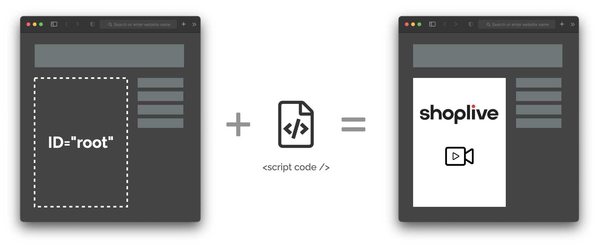

# Integrations

## Integrating web client

Javascript based web client of SHOPLIVE can be easily embedded into your website.

Set `ID` in the layer where the Live Commerce player will be located and add the SHOPLIVE JS code into the layer.

For more details, please refer to [Script Guide](./script).

## Authorization

When initializing the player script, you need to set userID and userName.
Two authorization methods (Simple ID/Password Auth and JWT Auth) are available.

| Authorization  | Integration Data                               | Description                                         |
| --------- | ----------------------------------------- | -------------------------------------------- |
| Simple Auth | { userID, userName, ... } | Simple way to integrate                              |
| JWT Auth  | xxxx.yyyy.zzzz (JSON Web Token)           | Generating JWT token with secret key in the server-side |

For more details about Authorization, please refer to [Authorization](./authorization).
