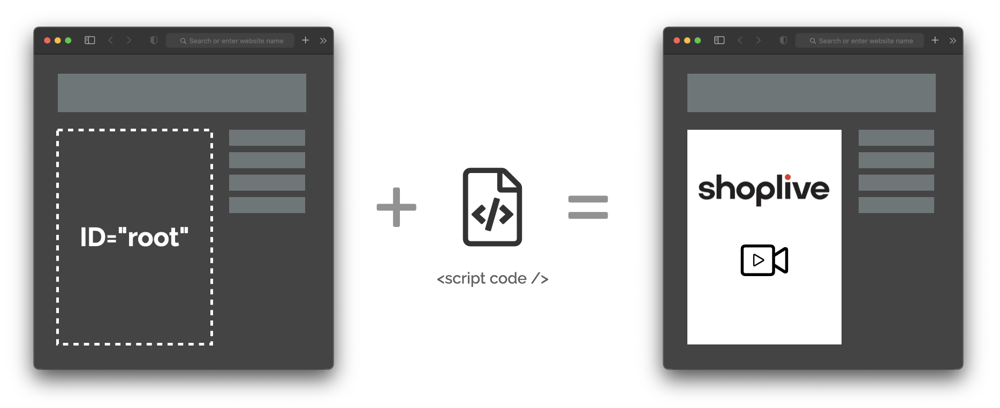

# Script Guide



Set `id` in the layer where SHOPLIVE player will be located and add SHOPLIVE JS code inside the layer.

## Script

After creating a DOM(div,...) to render the SHOPLIVE player and also setting id of the layer, please add the following scripts just before `</body>` tag.

```js
(function (s,h,o,p,l,i,v,e) {s["ShoplivePlayer"]=l;(s[l]=s[l]||function(){
(s[l].q=s[l].q||[]).push(arguments);}),(i=h.createElement(o)),
(v=h.getElementsByTagName(o)[0]);i.async=1;i.src=p;v.parentNode.insertBefore(i,v);
})(window,document,"script","https://static.shoplive.cloud/live.js","mplayer");

mplayer("init", "{{ access_key }}", "{{ campaign_key }}", "{{ user authorization }}", {{ options }});
mplayer("run", "{{ id }}");
```

### init funtion

Initialize SHOPLIVE player

`mplayer("init", access_key, campaign_key, user_authorization, options)`

| Argument        | Description                                                                | Sample                                                                    |
| ------------- | ------------------------------------------------------------------- | ----------------------------------------------------------------------- |
| access_key    | Unique key issued by SHOPLIVE                                                       | uv9CGthPzlvsInZerCw0                                                    |
| campaign_key  | Unique key for each campaign. (This key is generated when creating a campaign in the SHOPLIVE admin tool)<br />If null, Player will automatically use the last created campaign in the list. | PzlvsInZ                                                                |
| authorization | User authorization info. <br/> Add '' in case of guest user                   | Depending on authorization method.<br />Please refer to [Authorization](./authorization) |
| options       |                                                            | { messageCallback }                                                     |

**options**

| Argument          | Description                                                       |
| --------------- | ---------------------------------------------------------- |
| messageCallback | Use pre-defined action or custom action can be defined  |
| isFullScreen    | `true` - Full Screen, `false` - Keep Ratio, (default) - Automatic |

**messageCallback**

| action name          | payload                         | Description                                                           |
| ----------------- | ------------------------------- | -------------------------------------------------------------- |
| `REQUEST_LOGIN`   | N/A                            | Use when login is required. <br />(e.g., Only logged in user can chat) |
| `ERROR`           | code(Error Code), msg(Error Message) | Use when error occurs.<br /> Please see the details of [error code](./error-code) |
| `DOWNLOAD_COUPON` | coupon(coupon code)                | Coupon Download                                                  |

```js
var messageCallback = function(action, payload) {
  switch (action) {
    case "REQUEST_LOGIN": // When login is required
      alert("Login is required");
      break;
    case "ERROR": // To handle error
      console.log(payload.code); // error code
      console.log(payload.msg); // error message
      break;
    case "DOWNLOAD_COUPON": // download coupon
      alert(payload.coupon + "Coupon has been downloaded!");
      break;
  }
};

var options = {
  messageCallback: messageCallback,
};

mplayer("init", access_key, campaign_key, user_authorization, options);
```

### run function

Run SHOPLIVE player

`mplayer("run", id)`

| Argument | Description                         | Sample           |
| ------ | ---------------------------- | -------------- |
| id     | ID of the DOM that renders SHOPLIVE player | shoplivePlayer |

```js
mplayer("run", "{{ id }}");
```

### send function

To send a command to the SHOPLIVE player

`mplayer("send", action, payload)`

Please find more details in the [Demo](../demo/controls).

```js
mplayer("send", "hideControls");
```
