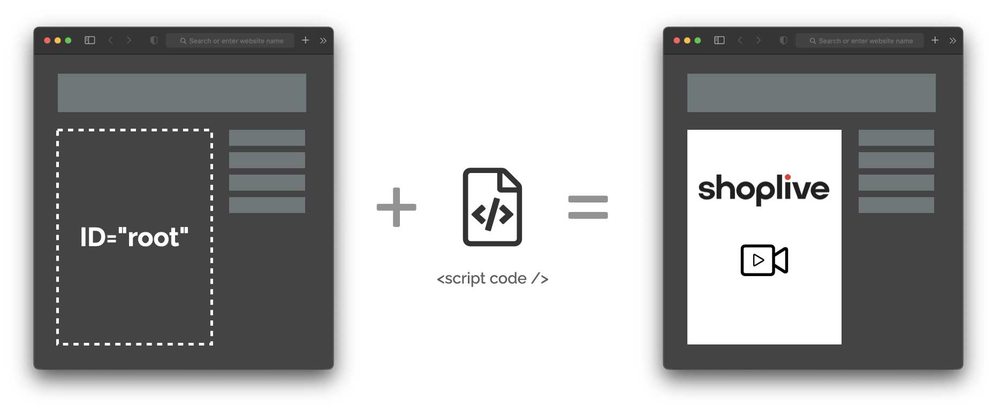

# 연동방식

## 웹기반 플레이어 연동

샵라이브는 자바스크립트를 이용하여 라이브 플레이어를 페이지에 삽입합니다.

플레이어가 삽입될 영역에 `id`를 지정하고 정해진 스크립트를 호출하면 연동이 마무리됩니다.

자세한 연동은 [스크립트 가이드](./script)를 참고하세요.

## 사용자 정보 연동

스크립트 초기화 시 사용자 아이디, 사용자 이름을 전달합니다.

별도 인증토큰이 필요하지 않은 일반 인증과 JWT를 이용한 강한 인증 방식을 사용할 수 있습니다.

| 인증방식  | 연동 데이터                               | 특징                                         |
| --------- | ----------------------------------------- | -------------------------------------------- |
| 일반 인증 | { user_id: 아이디, user_name: 이름, ... } | 간편한 연동방식                              |
| JWT 인증  | xxxx.yyyy.zzzz (JSON Web Token)           | 서버에서 주어진 비밀키로 JWT를 생성하는 방식 |

인증과 관련된 내용은 [인증](./authorization)을 참고하세요.
